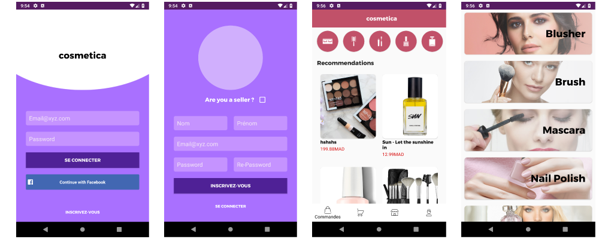
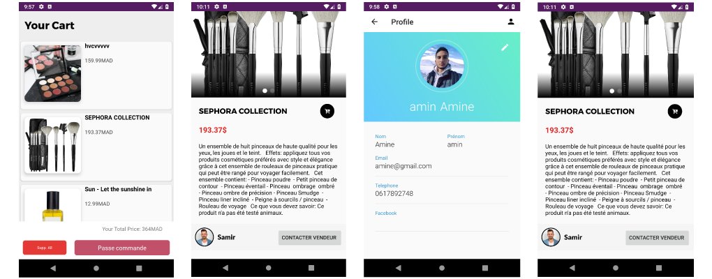

# EcommerceCosmetica

Cosmetica is an android project based on Firebsase Firestore.  
After graduating my master degree I wanted to share the application I've made to complete my second year, so other people can use it in a free way.  

### Functions : 
- Register Page `register.xml` (Firebase Authentication)
- Login Page `login.xml` : Using Facebook or Email&Password (Firebase Authentication)
- Profile `activity_profile.xml` (ability to add or update profile's picture)
- HomePage `activity_home.xml` : This is the main page where the newest products are listed, and also the categories.
- Categories Page `activity_categories.xml`: This Page contains all categories of products.
- Cart `activity_cart.xml` (Using TinyDB, based on SharedPreferences)
- Orders `activity_profile.xml` : This page shows the shipped, in process and canceled orders.

### Libraries Used:
| Library | Link |
| ------ | ------ |
| FancyButtons | [/medyo/Fancybuttons][fbl] |
| CircleImageView | [/hdodenhof/CircleImageView][circularimg] |
| Glide | [/bumptech/glide][glidelib] |
| Android-Image-Slider | [/smarteist/android-image-slider][sliderlib] |

### Developed By:
Karimi Amine  
Contact me on : [facebook] 

[facebook]: <https://www.facebook.com/amine.karimiii>
[fbl]: <https://github.com/medyo/Fancybuttons>
[circularimg]: <https://github.com/hdodenhof/CircleImageView>
[glidelib]: <https://github.com/bumptech/glide>
[sliderlib]: <https://github.com/smarteist/android-image-slider>

